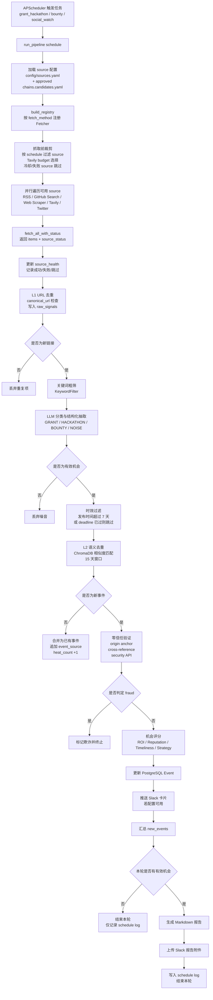

# Web3 Automated Agent

一个面向 Grants / Hackathons / Bounties 的自动化情报代理：

- 定时抓取多源信息（RSS、GitHub Search、网页抓取、Tavily、Twitter Social Watch）
- 双层去重（URL + 语义）
- 分类、验证、评分
- 推送到 Slack
- 产出本地 Markdown 报告与可视化面板

适合用于团队持续监控 Web3 机会，并做结构化沉淀。

## 1. 功能概览

- 多源抓取：RSS、GitHub Issues Search、Twitter（Twikit）、Web Scraper、Tavily Search
- 流程管道：Fetch -> Dedup(L1/L2) -> Classify -> Verify -> Score -> Dispatch
- 存储层：PostgreSQL（业务数据）+ ChromaDB（语义向量）
- 消息分发：Slack Block Kit 卡片 + 运行报告文件上传（需 Slack 权限）
- Web 面板：Streamlit 查看 Opportunities、Source Health、Schedule Logs

## 2. 目录结构

- `src/main.py`：主入口与完整 Pipeline 调度执行
- `src/fetchers/`：数据抓取器实现（含 GitHub / Tavily）
- `src/dedup/`：URL 去重与语义去重
- `src/classifier/`：关键词过滤、LLM 分类与评分
- `src/verifier/`：零信任校验与风控逻辑
- `src/dispatch/`：Slack 推送、报告写入、Heartbeat
- `src/db/`：SQLAlchemy 模型、查询与 DB 初始化
- `src/web/app.py`：Streamlit Dashboard
- `config/sources.yaml`：数据源配置
- `config/settings.py`：环境变量配置映射
- `reports/`：运行生成的 Markdown 报告
- `.vscode/sessions.json`：预置运维终端命令

## 3. 机会信息获取流程

当前机会抓取由 `grant_hackathon`、`bounty`、`social_watch` 三类 schedule 触发，统一进入 `run_pipeline()` 主链路。



## 4. 先决条件

- Docker + Docker Compose
- 可用的 API Key（至少一个 LLM）
- Slack Bot Token（如需推送）

## 5. 环境变量

复制并编辑：

```bash
cp .env.example .env
```

重点变量：

- 数据库：`POSTGRES_USER` `POSTGRES_PASSWORD` `POSTGRES_DB` `POSTGRES_HOST` `POSTGRES_PORT`
- 向量库：`CHROMA_HOST` `CHROMA_PORT`
- LLM：`DEEPSEEK_API_KEY` / `QWEN_API_KEY` / `GEMINI_API_KEY`
- Slack：`SLACK_BOT_TOKEN` `SLACK_CHANNEL_ID`
- 搜索：`GITHUB_TOKEN` `TAVILY_API_KEY` `DEFILLAMA_CHAINS_URL`
- Tavily 调度控制：`TAVILY_SUCCESS_COOLDOWN_MINUTES` `TAVILY_MAX_SOURCES_PER_RUN`
- Twitter：`TWITTER_AUTH_INFO_1` `TWITTER_AUTH_INFO_2` `TWITTER_PASSWORD` `TWITTER_TOTP_SECRET` `TWITTER_COOKIES_FILE`
- 运行：`LOG_LEVEL` `HEARTBEAT_INTERVAL_MINUTES` `SOCIAL_WATCH_INTERVAL_MINUTES` `TWITTER_FETCH_COUNT`
- 每日汇总：`DAILY_SUMMARY_ENABLED` `DAILY_SUMMARY_CRON`

当前 Tavily 默认值：

- `TAVILY_SUCCESS_COOLDOWN_MINUTES=5760`：同一个 Tavily source 成功执行后，4 天内不重复搜索
- `TAVILY_MAX_SOURCES_PER_RUN=1`：每个 schedule 每轮最多只执行 1 个 Tavily source，按“最久未抓取优先”轮转

注意：修改 `.env` 后，若容器已在运行，需要重建应用容器使新环境生效。

## 6. 启动与停止

启动全部服务：

```bash
docker compose up -d --build
```

查看状态：

```bash
docker compose ps
```

查看日志：

```bash
docker compose logs -f --tail 200
```

停止服务：

```bash
docker compose down
```

仅重建主应用容器（常用于环境变量更新后）：

```bash
docker compose up -d --force-recreate agent-app
```

## 7. 调度策略（Asia/Shanghai）

- `grant_hackathon`：每天 09:00、21:00
- `bounty`：每 2 小时
- `social_watch`：每 `SOCIAL_WATCH_INTERVAL_MINUTES` 分钟
- `heartbeat`：每 `HEARTBEAT_INTERVAL_MINUTES` 分钟
- `daily_summary`：每天按 `DAILY_SUMMARY_CRON` 发送 Slack 日报（默认 23:55，Asia/Shanghai）

启动时会先立即跑一次：

- grant_hackathon
- bounty
- social_watch
- heartbeat

Twitter 说明：

- Twitter/X 监听已从 RSSHub 切换为 Twikit。
- 仓库内置的 Twitter sources 默认保持禁用，避免在未配置 X 登录态时让启动自检失败。
- `official` Twitter sources 会直入主 pipeline；`discovery` Twitter sources 会先经过预处理降噪。

时效性清洗说明：

- 发布时间超过 7 天的候选会在分类后、入库前被跳过
- 已经过了 `deadline` 的候选会被跳过
- Twitter 抓取会透传 tweet `created_at`，用于这层时效过滤

## 8. Slack 与报告行为

当前行为：

- 有有效机会数据时：发送机会卡片；并上传当轮完整报告文件
- 无有效机会数据时：不发送卡片，不上传报告文件
- 每日汇总 job 会固定发送一次日报；即使当天没有新的 qualified opportunities，也会发送当天的抓取/去重/验证摘要
- 若当天存在新的 qualified opportunities，日报会额外列出这些新增事件及其对应的 source names

Slack 附件上传需要 Bot Scope：

- `files:write`

如果仅有 `chat:write`，卡片可发但文件上传会失败（missing_scope）。

## 9. Dashboard（可选）

在容器中启动 Streamlit：

```bash
docker exec -d web3_agent_main streamlit run src/web/app.py --server.port 8501 --server.address 0.0.0.0
```

访问：

- http://localhost:8501

## 10. 数据库运维（常用）

查看表：

```bash
docker compose exec postgres psql -U web3agent -d web3agent -c "\\dt"
```

备份：

```bash
mkdir -p backups && docker compose exec -T postgres pg_dump -U web3agent -d web3agent > backups/web3agent_$(date +%Y%m%d_%H%M%S).sql
```

恢复最近备份：

```bash
latest=$(ls -t backups/*.sql 2>/dev/null | head -1); if [ -n "$latest" ]; then docker compose exec -T postgres psql -U web3agent -d web3agent < "$latest"; fi
```

## 11. 运营脚本（新增）

全量信息源抓取（仅抓取并输出 source 级成功/失败，不走完整分类与推送）：

```bash
docker compose exec -T agent-app python scripts/fetch_all_sources.py
```

向量数据库检查（列出 collections、数量，并抽样展示 metadata/document 预览）：

```bash
docker compose exec -T agent-app python scripts/inspect_vector_db.py
```

## 12. Source Health 粒度说明（更新）

- 现在按 source 实际执行结果更新健康状态。
- 某个 source 请求异常（如 404/429/422）会标记为 `degraded`，连续失败达到阈值后会进入 `down`。
- 仅该 source 本轮成功时才会回到 `healthy`。
- 不再出现“某 source 明明失败但被统一标记 healthy”的情况。
- Tavily source 额外支持成功冷却：近期成功抓取过的 source 会返回 `success_cooldown` 并被跳过。

常用查询：

```bash
docker compose exec -T postgres psql -U web3agent -d web3agent -c "SELECT source_name,status,consecutive_failures,left(coalesce(last_error,''),120) AS last_error FROM source_health ORDER BY source_name;"
```

## 13. 常见问题排查

1. 配置已改但程序没生效

- 原因：容器仍在使用旧环境
- 处理：`docker compose up -d --force-recreate agent-app`

2. GitHub 抓取命中率低或速率受限

- 检查：`GITHUB_TOKEN` 是否注入容器
- 检查方法：容器内打印环境变量长度

3. Slack 报错 `not_authed`

- 检查 `SLACK_BOT_TOKEN` 是否正确
- 变更 Token 后重建容器

4. Slack 报错 `missing_scope`

- 给 Bot 增加 `files:write`
- 重新安装 App 到 Workspace

5. Tavily 消耗过快

- 检查 `TAVILY_SUCCESS_COOLDOWN_MINUTES` 与 `TAVILY_MAX_SOURCES_PER_RUN`
- 现在 Tavily 不是对每条候选都调用，而是对每个启用的 `tavily_search` source 在预算内执行
- 若仍需进一步降频，优先调小 `TAVILY_MAX_SOURCES_PER_RUN` 或拉长 `TAVILY_SUCCESS_COOLDOWN_MINUTES`

## 15. DefiLlama Seed Sync

Generate a reviewed candidate chain snapshot from DefiLlama:

```bash
python scripts/sync_defillama_chains.py --top-n 50
```

This overwrites `config/chains.candidates.yaml` with the latest reviewed candidate snapshot.

Default endpoint:

```bash
DEFILLAMA_CHAINS_URL=https://api.llama.fi/v2/chains
```

Scheduled refresh is also enabled in the main agent runtime by default:

```bash
DEFILLAMA_SYNC_ENABLED=true
DEFILLAMA_SYNC_CRON="30 6 * * *"
DEFILLAMA_SYNC_TOP_N=50
```

The cron is interpreted in the app scheduler timezone (`Asia/Shanghai`).

This command updates `config/chains.candidates.yaml` only. It does not auto-enable chains in `config/chains.yaml`.

Current importer behavior also filters a small set of obvious non-target chains before review so the candidate file is less noisy. Approved chains in `config/chains.yaml` still pass through unchanged.

## 16. Chain-Aware Source Metadata

`config/sources.yaml` now supports these fields on each source entry:

- `chain`: canonical ecosystem id
- `source_tier`: `official` or `discovery`
- `signal_type`: `grant`, `hackathon`, `bounty`, `social`, or `discovery`
- `official`: trust hint for downstream verification

Existing entries do not need to be rewritten immediately. The loader in `src/fetchers/builder.py` backfills these fields automatically from `ecosystem`, `category`, and `fetch_method` so migration can happen incrementally.

近期新增示例 source：

- `stellar_scf_rfp_track`：使用 `web_scraper` 抓取 Stellar SCF RFP Track GitBook 页面，归类为 `grant_hackathon` / `stellar` / `official`

## 14. 新成员交接建议

建议按以下顺序熟悉项目：

1. 阅读 `config/sources.yaml`，理解来源和 schedule
2. 阅读 `src/main.py`，理解全链路执行流程
3. 阅读 `src/db/models.py`，理解核心数据模型
4. 在本地跑一轮并观察 `docker compose logs`
5. 在 Slack 验证卡片与报告上传行为

---

## 15. Agent Chat V1 (Read-Only)

后端 API：

- 启动：`uvicorn src.chat_api.app:app --host 0.0.0.0 --port 9000`
- 健康检查：`GET /api/v1/chat/health`
- 目标选择：`POST /api/v1/chat/select-targets`
- 可靠性验证：`POST /api/v1/chat/verify`
- 方案建议：`POST /api/v1/chat/propose-options`

前端：

- `cd apps/chat-web && pnpm install && pnpm dev`

必需环境变量：

- `CHAT_API_BASE_URL`
- `CHAT_API_INTERNAL_KEY`

部署说明：

- Chat API 运行时应使用只读数据库凭据。
- 采集/入库 Pipeline 与 Chat API 使用独立凭据。
- 前端可部署到 Vercel，需同步配置 `CHAT_API_BASE_URL` 与 `CHAT_API_INTERNAL_KEY`。

如需扩展新数据源，优先在 `src/fetchers/` 增加 fetcher 并在 `src/fetchers/builder.py` 注册，再在 `config/sources.yaml` 增加 source 配置。
